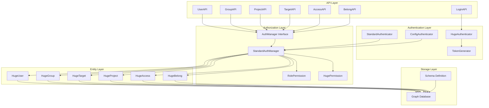
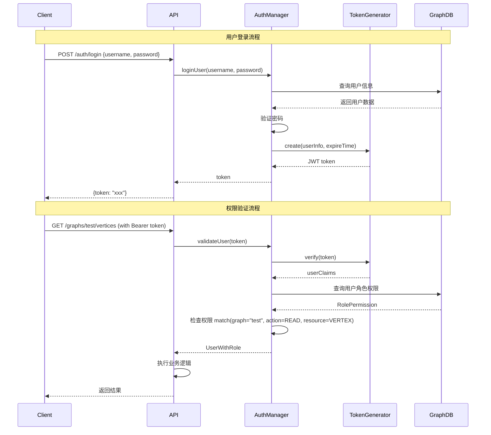
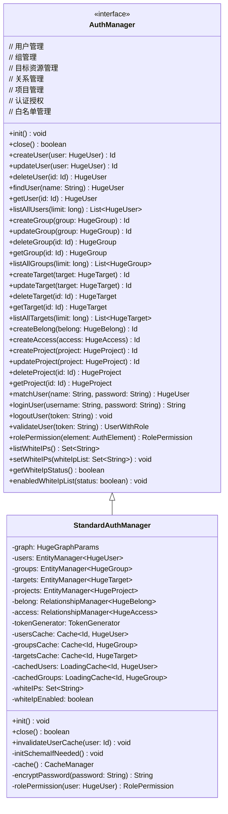
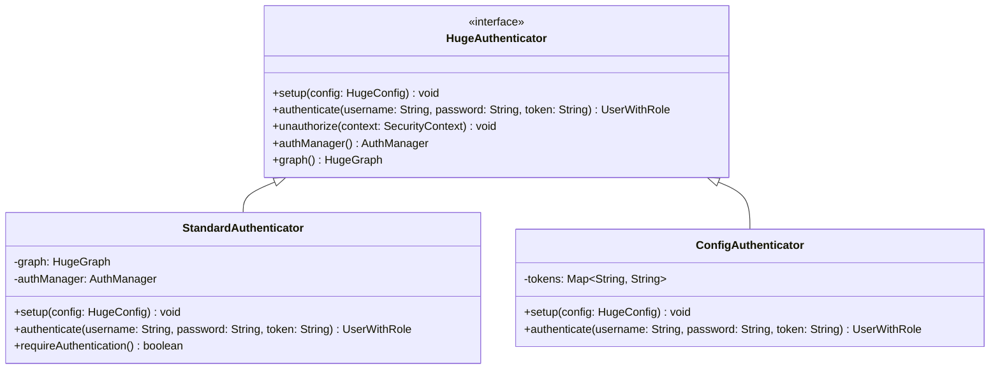
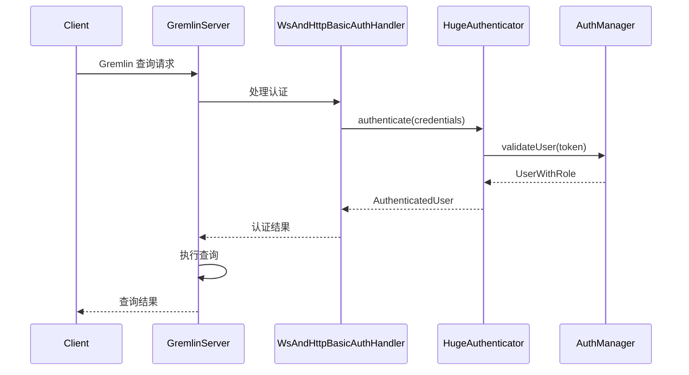
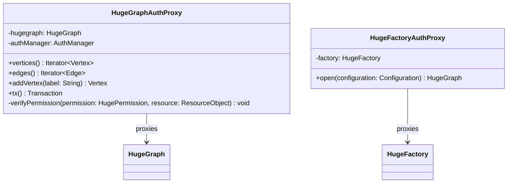
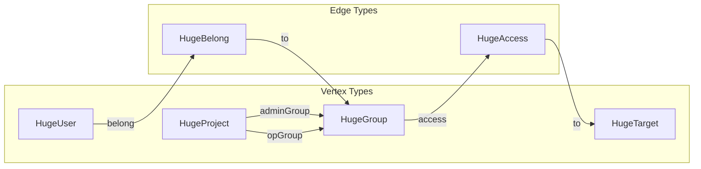

# HugeGraph Auth 模块调研报告

## 1. 概述

HugeGraph 的认证授权（Auth）模块是一个完整的基于角色的访问控制（RBAC）系统，提供了从用户认证到细粒度权限控制的完整解决方案。该模块支持 JWT 令牌认证、多租户隔离、资源级权限控制等企业级安全特性。

## 2. 整体架构设计

### 2.1 架构层次图



### 2.2 核心组件说明

1. **API层**：提供RESTful接口，处理HTTP请求
2. **认证层**：处理用户身份验证和令牌管理
3. **授权层**：管理权限检查和访问控制
4. **实体层**：定义认证授权相关的核心数据模型
5. **存储层**：基于图数据库的持久化存储

## 3. 核心实体设计

### 3.1 实体关系图

```mermaid
classDiagram
    class AuthManager {
        <<interface>>
        +createUser(user: HugeUser) Id
        +createGroup(group: HugeGroup) Id
        +createTarget(target: HugeTarget) Id
        +createProject(project: HugeProject) Id
        +createBelong(belong: HugeBelong) Id
        +createAccess(access: HugeAccess) Id
        +loginUser(username: String, password: String) String
        +validateUser(token: String) UserWithRole
        +rolePermission(element: AuthElement) RolePermission
    }
    
    class StandardAuthManager {
        -graph: HugeGraphParams
        -users: EntityManager~HugeUser~
        -groups: EntityManager~HugeGroup~
        -targets: EntityManager~HugeTarget~
        -projects: EntityManager~HugeProject~
        -belong: RelationshipManager~HugeBelong~
        -access: RelationshipManager~HugeAccess~
        -tokenGenerator: TokenGenerator
        +init() void
        +close() boolean
        +matchUser(name: String, password: String) HugeUser
    }
    
    class HugeUser {
        -id: Id
        -name: String
        -nickname: String
        -password: String
        -phone: String
        -email: String
        -avatar: String
        -description: String
        -role: RolePermission
        +type() ResourceType
        +label() String
        +name() String
    }
    
    class HugeGroup {
        -id: Id
        -name: String
        -nickname: String
        -description: String
        +type() ResourceType
        +label() String
        +name() String
    }
    
    class HugeTarget {
        -id: Id
        -name: String
        -graph: String
        -description: String
        -url: String
        -resources: List~HugeResource~
        +type() ResourceType
        +label() String
        +name() String
    }
    
    class HugeProject {
        -id: Id
        -name: String
        -adminGroupId: Id
        -opGroupId: Id
        -graphs: Set~String~
        -targetId: Id
        -description: String
        +type() ResourceType
        +adminGroupId() Id
        +opGroupId() Id
        +graphs() Set~String~
    }
    
    class HugeBelong {
        -user: Id
        -group: Id
        -link: String
        -description: String
        +type() ResourceType
        +source() Id
        +target() Id
        +sourceLabel() String
        +targetLabel() String
    }
    
    class HugeAccess {
        -group: Id
        -target: Id
        -permission: HugePermission
        -description: String
        +type() ResourceType
        +source() Id
        +target() Id
        +permission() HugePermission
    }
    
    class HugePermission {
        <<enumeration>>
        NONE
        READ
        WRITE
        DELETE
        EXECUTE
        ANY
        +match(other: HugePermission) boolean
    }
    
    class RolePermission {
        -roles: Map~String, Map~HugePermission, List~HugeResource~~~
        +add(graph: String, action: HugePermission, resources: List~HugeResource~) void
        +contains(other: RolePermission) boolean
        +match(graph: String, action: HugePermission, resource: HugeResource) boolean
    }
    
    class TokenGenerator {
        -key: SecretKey
        +create(payload: Map~String, Object~, expire: long) String
        +verify(token: String) Claims
    }
    
    AuthManager <|-- StandardAuthManager
    StandardAuthManager --> HugeUser : manages
    StandardAuthManager --> HugeGroup : manages
    StandardAuthManager --> HugeTarget : manages
    StandardAuthManager --> HugeProject : manages
    StandardAuthManager --> HugeBelong : manages
    StandardAuthManager --> HugeAccess : manages
    StandardAuthManager --> TokenGenerator : uses
    StandardAuthManager --> RolePermission : creates
    
    HugeUser ||--o{ HugeBelong : belongs to
    HugeGroup ||--o{ HugeBelong : contains
    HugeGroup ||--o{ HugeAccess : has
    HugeTarget ||--o{ HugeAccess : grants
    HugeAccess --> HugePermission : defines
    HugeProject --> HugeGroup : adminGroup
    HugeProject --> HugeGroup : opGroup
    HugeUser --> RolePermission : has
```

### 3.2 实体详细说明

#### HugeUser（用户）
- **功能**：系统中的用户实体，包含用户基本信息和认证凭据
- **关键属性**：
  - `name`：用户名（唯一标识）
  - `password`：加密后的密码
  - `email`、`phone`：联系方式
  - `role`：缓存的角色权限信息

#### HugeGroup（用户组）
- **功能**：用户的逻辑分组，便于批量权限管理
- **关键属性**：
  - `name`：组名（唯一标识）
  - `description`：组描述信息

#### HugeTarget（目标资源）
- **功能**：定义可被保护的资源，如图、API端点等
- **关键属性**：
  - `graph`：所属图名称
  - `url`：资源URL模式
  - `resources`：具体的资源列表

#### HugeProject（项目）
- **功能**：多租户支持，将图和用户组织到项目中
- **关键属性**：
  - `adminGroupId`：管理员组ID
  - `opGroupId`：操作员组ID
  - `graphs`：项目包含的图集合

#### HugeBelong（归属关系）
- **功能**：定义用户与组的归属关系
- **关系类型**：User -> Group

#### HugeAccess（访问权限）
- **功能**：定义组对目标资源的访问权限
- **关系类型**：Group -> Target
- **权限级别**：基于 HugePermission 枚举

## 4. 权限系统设计

### 4.1 权限层次结构

```mermaid
graph TD
    A[HugePermission.ANY] --> B[HugePermission.READ]
    A --> C[HugePermission.WRITE]
    A --> D[HugePermission.DELETE]
    A --> E[HugePermission.EXECUTE]
    
    F[ResourceType] --> G[ROOT]
    F --> H[ALL]
    F --> I[SCHEMA]
    F --> J[VERTEX]
    F --> K[EDGE]
    F --> L[GREMLIN]
    F --> M[USER_GROUP]
    F --> N[PROJECT]
    F --> O[TARGET]
    F --> P[GRANT]
    
    Q[RolePermission] --> R["Graph1 -> READ -> [Resource1, Resource2]"]
    Q --> S["Graph1 -> WRITE -> [Resource3]"]
    Q --> T["Graph2 -> EXECUTE -> [Gremlin Scripts]"]
```



### 4.2 权限检查流程



## 5. 核心接口和实现

### 5.1 AuthManager 接口设计



### 5.2 认证器实现



## 6. API 设计

### 6.1 REST API 端点

| API分类 | 端点 | 方法 | 功能 |
|---------|------|------|------|
| 认证 | `/graphs/{graph}/auth/login` | POST | 用户登录 |
| 认证 | `/graphs/{graph}/auth/logout` | DELETE | 用户登出 |
| 用户管理 | `/graphs/{graph}/auth/users` | GET/POST | 查询/创建用户 |
| 用户管理 | `/graphs/{graph}/auth/users/{id}` | GET/PUT/DELETE | 用户CRUD操作 |
| 组管理 | `/graphs/{graph}/auth/groups` | GET/POST | 查询/创建组 |
| 组管理 | `/graphs/{graph}/auth/groups/{id}` | GET/PUT/DELETE | 组CRUD操作 |
| 目标管理 | `/graphs/{graph}/auth/targets` | GET/POST | 查询/创建目标 |
| 目标管理 | `/graphs/{graph}/auth/targets/{id}` | GET/PUT/DELETE | 目标CRUD操作 |
| 关系管理 | `/graphs/{graph}/auth/belongs` | GET/POST | 查询/创建归属关系 |
| 关系管理 | `/graphs/{graph}/auth/accesses` | GET/POST | 查询/创建访问权限 |
| 项目管理 | `/graphs/{graph}/auth/projects` | GET/POST | 查询/创建项目 |

### 6.2 API 调用示例

```json
// 用户登录
POST /graphs/hugegraph/auth/login
{
    "user_name": "admin",
    "user_password": "admin123",
    "expire": 3600
}

// 创建用户
POST /graphs/hugegraph/auth/users
{
    "user_name": "test_user",
    "user_password": "test123",
    "user_email": "test@example.com"
}

// 创建组
POST /graphs/hugegraph/auth/groups
{
    "group_name": "test_group",
    "group_description": "测试用户组"
}

// 创建归属关系
POST /graphs/hugegraph/auth/belongs
{
    "user": "test_user",
    "group": "test_group"
}

// 创建访问权限
POST /graphs/hugegraph/auth/accesses
{
    "group": "test_group",
    "target": "gremlin",
    "access_permission": "READ"
}
```

## 7. 集成机制

### 7.1 Gremlin Server 集成



### 7.2 Graph 代理集成



## 8. 存储设计

### 8.1 Schema 定义

Auth 模块使用图数据库自身来存储认证授权数据，通过 `SchemaDefine` 定义了以下Schema：



### 8.2 数据持久化

- **实体管理器**（EntityManager）：管理顶点实体的CRUD操作
- **关系管理器**（RelationshipManager）：管理边关系的CRUD操作
- **缓存策略**：使用 Caffeine 缓存提升查询性能
- **事务支持**：所有操作都在事务内执行，保证数据一致性

## 9. 安全特性

### 9.1 密码安全
- 使用 BCrypt 或类似算法进行密码哈希
- 支持密码强度策略配置
- 密码传输时需要HTTPS保护

### 9.2 令牌安全
- 基于 JWT 标准实现
- 支持令牌过期时间配置
- 使用 HMAC SHA-256 签名算法
- 支持令牌黑名单机制

### 9.3 网络安全
- IP 白名单支持
- 支持动态启用/禁用白名单
- 集成 HTTPS 传输层安全

### 9.4 审计日志
- 记录所有认证授权操作
- 支持操作日志查询
- 集成监控和告警机制

## 10. 性能优化

### 10.1 缓存策略
- **用户缓存**：缓存活跃用户信息
- **组缓存**：缓存组信息和成员关系
- **权限缓存**：缓存角色权限映射
- **令牌缓存**：缓存有效令牌避免重复验证

### 10.2 查询优化
- 为认证查询创建专门的索引
- 使用批量查询减少数据库交互
- 权限检查时采用短路求值

## 11. 扩展点

### 11.1 自定义认证器
- 可实现 `HugeAuthenticator` 接口支持其他认证方式
- 支持 LDAP、SAML、OAuth2 等企业认证协议
- 可集成第三方身份提供商

### 11.2 自定义权限模型
- 可扩展 `ResourceType` 枚举支持新的资源类型
- 可自定义 `HugePermission` 支持更细粒度的权限
- 支持动态权限策略

### 11.3 审计扩展
- 可实现自定义审计日志收集器
- 支持集成外部审计系统
- 可配置审计事件过滤规则

## 12. 部署配置

### 12.1 配置选项

```properties
# 认证基础配置
auth.authenticator=org.apache.hugegraph.auth.StandardAuthenticator
auth.admin_token=162f7848-0b6d-4faf-b557-3a0797869c55

# 令牌配置
auth.token_secret=2d7bfe19-1149-43aa-8e20-c9f84a298ff3
auth.token_expire=86400

# 白名单配置
auth.white_ips_enabled=false
auth.white_ips=127.0.0.1,192.168.1.0/24

# 缓存配置
auth.cache_capacity=1024
auth.cache_expire=600
```

### 12.2 启用认证

```bash
# 启用认证脚本
./bin/enable-auth.sh

# 手动配置
echo "auth.authenticator=org.apache.hugegraph.auth.StandardAuthenticator" >> conf/gremlin-server.yaml
echo "auth.admin_token=your-admin-token" >> conf/hugegraph.properties
```

## 13. 测试和验证

### 13.1 功能测试

```bash
# 启动 HugeGraph 服务器并启用认证
./bin/start-hugegraph.sh

# 创建测试用户
curl -X POST "http://localhost:8080/graphs/hugegraph/auth/users" \
  -H "Content-Type: application/json" \
  -H "Authorization: Bearer $ADMIN_TOKEN" \
  -d '{
    "user_name": "test_user",
    "user_password": "test123"
  }'

# 用户登录测试
curl -X POST "http://localhost:8080/graphs/hugegraph/auth/login" \
  -H "Content-Type: application/json" \
  -d '{
    "user_name": "test_user",
    "user_password": "test123"
  }'

# 权限验证测试
curl -X GET "http://localhost:8080/graphs/hugegraph/schema/vertexlabels" \
  -H "Authorization: Bearer $USER_TOKEN"
```

### 13.2 性能测试

```bash
# 并发认证测试
for i in {1..100}; do
  curl -X POST "http://localhost:8080/graphs/hugegraph/auth/login" \
    -H "Content-Type: application/json" \
    -d '{
      "user_name": "test_user'$i'",
      "user_password": "test123"
    }' &
done
wait

# 权限检查性能测试
ab -n 1000 -c 10 -H "Authorization: Bearer $TOKEN" \
  "http://localhost:8080/graphs/hugegraph/schema/propertykeys"
```

### 13.3 安全测试

```bash
# SQL注入测试
curl -X POST "http://localhost:8080/graphs/hugegraph/auth/login" \
  -H "Content-Type: application/json" \
  -d '{
    "user_name": "admin\"; DROP TABLE users; --",
    "user_password": "test123"
  }'

# 令牌篡改测试
curl -X GET "http://localhost:8080/graphs/hugegraph/schema/vertexlabels" \
  -H "Authorization: Bearer invalid_token_here"

# 暴力破解防护测试
for i in {1..1000}; do
  curl -X POST "http://localhost:8080/graphs/hugegraph/auth/login" \
    -H "Content-Type: application/json" \
    -d '{
      "user_name": "admin",
      "user_password": "wrong_password'$i'"
    }'
done
```

## 14. 总结

HugeGraph 的 Auth 模块是一个功能完善、设计良好的企业级认证授权系统，具有以下优势：

### 13.1 设计优势
1. **模块化设计**：清晰的分层架构，职责分明
2. **标准协议**：基于 JWT 标准，易于集成
3. **灵活扩展**：支持多种认证方式和自定义扩展
4. **细粒度控制**：支持资源级别的权限控制
5. **高性能**：多层缓存策略，优化查询性能

### 13.2 技术特点
1. **基于图存储**：利用图数据库的天然优势存储关系数据
2. **事务保证**：所有操作都有事务保护
3. **RESTful API**：完整的 REST API 支持
4. **多租户支持**：通过项目机制支持多租户隔离
5. **安全可靠**：多重安全机制保障系统安全

### 13.3 应用场景
1. **企业内部系统**：支持复杂的组织架构和权限体系
2. **多租户SaaS**：通过项目隔离实现多租户
3. **API网关集成**：作为微服务的统一认证授权中心
4. **图数据平台**：为图数据分析平台提供安全保障

该认证授权模块为 HugeGraph 提供了完整的安全保障，能够满足企业级应用的各种安全需求。